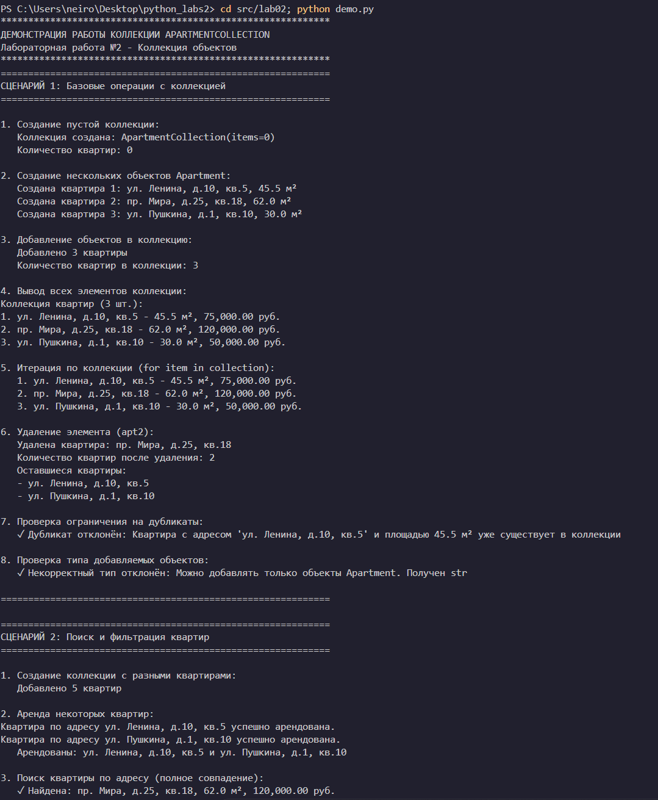
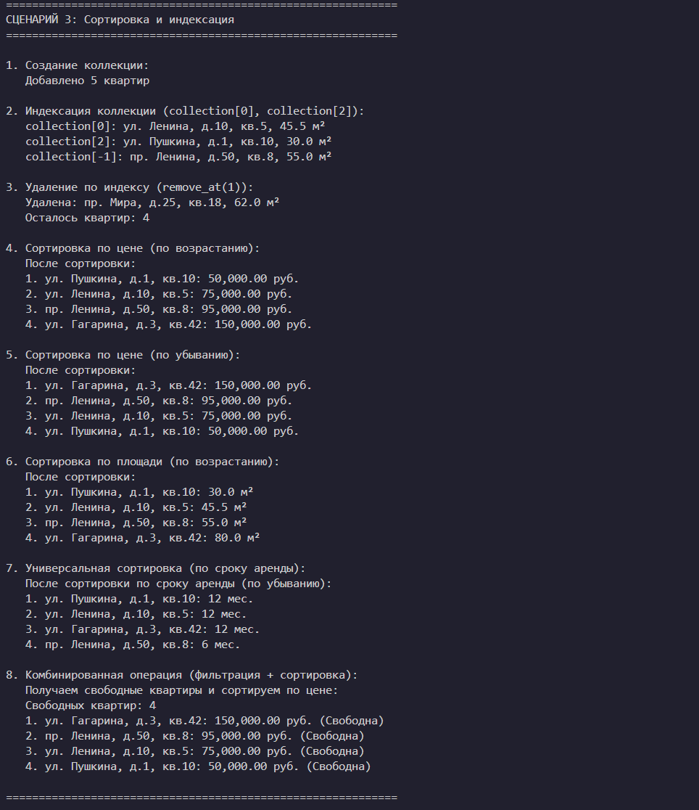
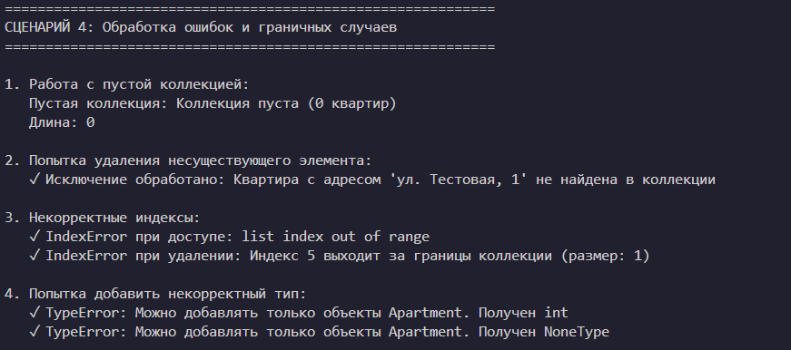

# Лабораторная работа №2 - Коллекция объектов
## Вариант 9 (продолжение)

### Предметная область
**Коллекция объектов Apartment (Квартиры)**

Коллекция управляет группой объектов Apartment, созданных в лабораторной работе №1.

### Реализованный контейнерный класс

#### `ApartmentCollection`
Контейнер для хранения и управления коллекцией квартир.

**Основные возможности:**
- Хранение множества объектов Apartment
- Управление добавлением и удалением
- Доступ к объектам через методы и индексацию
- Итерация по коллекции
- Проверка типа добавляемых объектов
- Предотвращение дубликатов (по адресу и площади)

### Методы класса ApartmentCollection

#### Базовые операции
- `add(item)` - добавить объект Apartment в коллекцию
- `remove(item)` - удалить объект Apartment из коллекции
- `remove_at(index)` - удалить объект по индексу
- `get_all()` - вернуть список всех объектов (копию)

#### Поиск и фильтрация
- `find_by_address(address)` - поиск квартиры по адресу (полное/частичное совпадение)
- `find_by_price_range(min_price, max_price)` - поиск квартир в ценовом диапазоне
- `find_by_area_range(min_area, max_area)` - поиск квартир в диапазоне площади
- `get_available()` - получить коллекцию свободных квартир
- `get_rented()` - получить коллекцию арендованных квартир
- `get_expensive(threshold)` - получить коллекцию дорогих квартир (дороже порога)
- `get_by_rent_duration(duration)` - получить коллекцию квартир с заданным сроком аренды

#### Сортировка
- `sort_by_price(reverse)` - сортировка по цене
- `sort_by_area(reverse)` - сортировка по площади
- `sort_by_rent_duration(reverse)` - сортировка по сроку аренды
- `sort(key, reverse)` - универсальная сортировка по заданному ключу

#### Магические методы
- `__len__()` - поддержка функции `len(collection)`
- `__iter__()` - поддержка итерации `for item in collection`
- `__getitem__(index)` - поддержка индексации `collection[0]`, `collection[-1]`
- `__str__()` - строковое представление коллекции
- `__repr__()` - техническое представление коллекции

### Требования к оценке 5

#### ✓ Задание на 3 (базовые требования)
- [x] Использован класс Apartment из ЛР-1
- [x] Реализован класс коллекции ApartmentCollection
- [x] Внутри контейнера хранится список объектов `self._items = []`
- [x] Реализованы методы: `add()`, `remove()`, `get_all()`
- [x] Проверка типа добавляемых объектов (только Apartment)
- [x] Демонстрация в demo.py: создание объектов, добавление, вывод, удаление

#### ✓ Задание на 4 (дополнительные требования)
- [x] Реализованы методы поиска: `find_by_address()`, `find_by_price_range()`, `find_by_area_range()`
- [x] Реализован `__len__()` для поддержки `len(collection)`
- [x] Реализован `__iter__()` for поддержки `for item in collection`
- [x] Добавлено ограничение на дубликаты (нельзя добавить квартиру с тем же адресом и площадью)
- [x] Демонстрация: поиск элемента, использование `len()`, использование `for`, работа ограничения на дубликаты

#### ✓ Задание на 5 (полные требования)
- [x] Реализована индексация через `__getitem__()` (`collection[0]`, `collection[2]`)
- [x] Реализовано удаление по индексу `remove_at(index)`
- [x] Реализована сортировка: `sort_by_price()`, `sort_by_area()`, `sort_by_rent_duration()`, универсальная `sort(key)`
- [x] Реализованы логические операции: `get_available()`, `get_rented()`, `get_expensive()`, `get_by_rent_duration()`
- [x] Методы фильтрации возвращают новую коллекцию
- [x] Демонстрация: индексация, сортировка, фильтрация, несколько сценариев работы (4 сценария)

### Сценарии использования (demo.py)

#### Сценарий 1: Базовые операции с коллекцией
- Создание коллекции
- Добавление объектов
- Вывод всех элементов
- Удаление элемента
- Проверка ограничений на дубликаты
- Проверка типа добавляемых объектов

#### Сценарий 2: Поиск и фильтрация квартир
- Поиск по адресу (полное и частичное совпадение)
- Фильтрация по ценовому диапазону
- Фильтрация по диапазону площади
- Получение свободных/арендованных квартир
- Получение дорогих квартир

#### Сценарий 3: Сортировка и индексация
- Индексация коллекции (`collection[0]`, `collection[-1]`)
- Удаление по индексу
- Сортировка по цене (возрастание/убывание)
- Сортировка по площади
- Универсальная сортировка
- Комбинированная фильтрация и сортировка

#### Сценарий 4: Обработка ошибок и граничных случаев
- Работа с пустой коллекцией
- Попытка удаления несуществующего элемента
- Некорректные индексы
- Попытка добавления некорректного типа

### Инварианты коллекции
- В коллекции могут храниться только объекты типа `Apartment`
- Нельзя добавить дубликат (квартира с тем же адресом и площадью)
- Коллекция возвращает копии данных для предотвращения внешних изменений
- Все методы фильтрации возвращают новые коллекции, не изменяя исходную

### Примеры использования

```python
# Создание коллекции
collection = ApartmentCollection()

# Добавление квартир
apt1 = Apartment(45.5, 75000, "ул. Ленина, д.10, кв.5", 12)
apt2 = Apartment(62.0, 120000, "пр. Мира, д.25, кв.18", 6)
collection.add(apt1)
collection.add(apt2)

# Базовые операции
print(len(collection))  # 2
for apartment in collection:
    print(apartment.address)

# Индексация
print(collection[0].price)  # 75000

# Поиск
found = collection.find_by_address("Ленина")

# Фильтрация
available = collection.get_available()
expensive = collection.get_expensive(100000)

# Сортировка
collection.sort_by_price(reverse=True)
collection.sort(key=lambda x: x.area)

# Удаление
collection.remove_at(0)
collection.remove(apt1)
```

### Запуск демонстрации
```bash
cd src/lab02
python demo.py
```

### Структура проекта
```
python_labs2/
├── src/
│   ├── lab01/          # Класс Apartment (ЛР-1)
│   └── lab02/          # Коллекция ApartmentCollection (ЛР-2)
│       ├── __init__.py
│       ├── model.py    # Импорт Apartment из lab01
│       ├── collection.py # Класс ApartmentCollection
│       ├── demo.py     # Демонстрация работы
│       └── README.md   # Документация
└── images/
    └── lab02/          # Скриншоты работы программы

### Скриншоты работы программы






