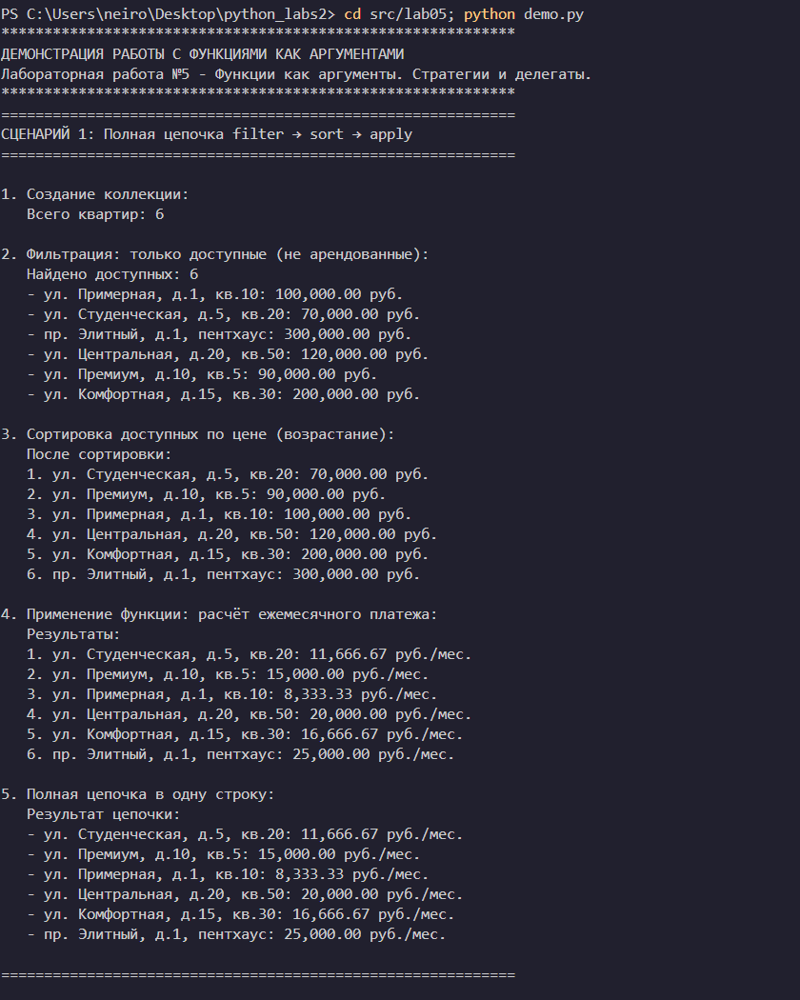
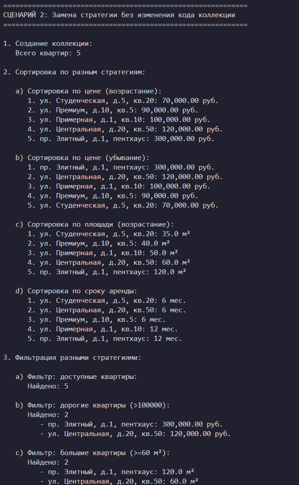
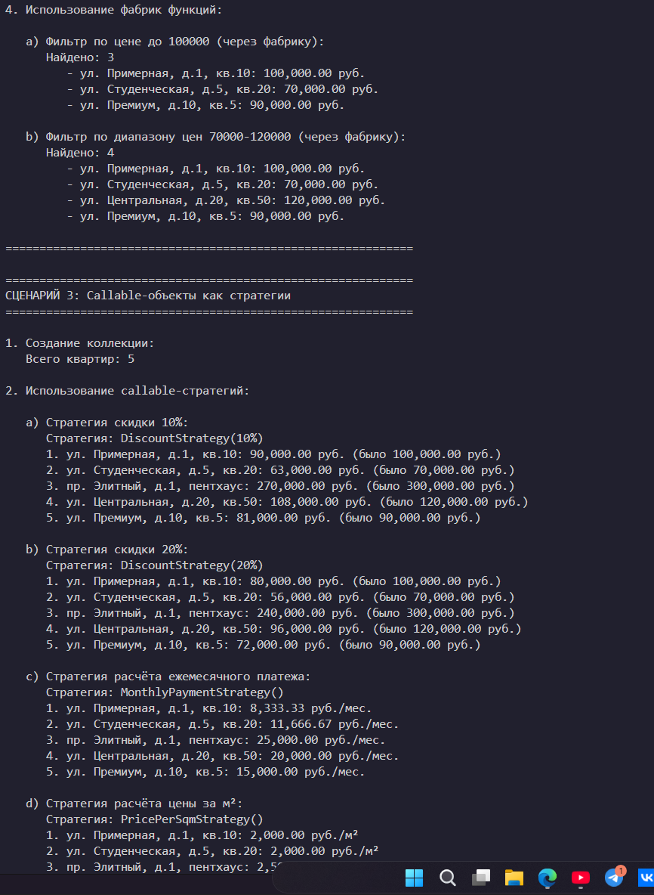
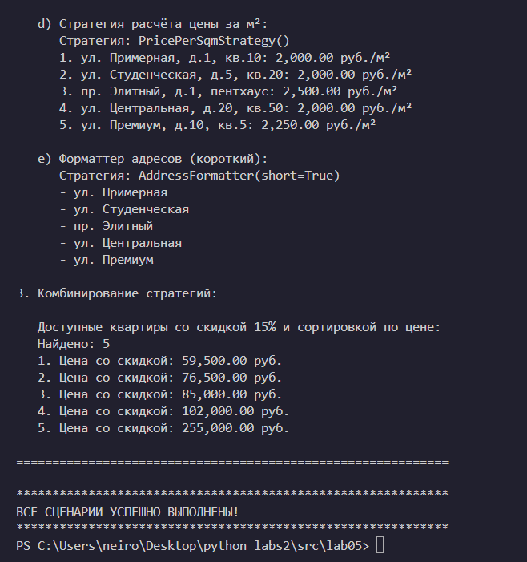

# Лабораторная работа №5 - Функции как аргументы. Стратегии и делегаты.
## Вариант 9 (продолжение)

### 1. Цель работы
Освоить передачу функций как аргументов в другие функции и методы, научиться применять встроенные функции высшего порядка (map, filter, sorted), понять концепцию паттерна "Стратегия" и реализовать его на Python, освоить lambda-выражения и их практическое применение, интегрировать функциональный стиль с объектно-ориентированным кодом.

### 2. Реализованные функции и стратегии

#### Стратегии сортировки (функции-ключи)
- `by_price(apartment)` - сортировка по цене (возрастание)
- `by_price_desc(apartment)` - сортировка по цене (убывание)
- `by_area(apartment)` - сортировка по площади (возрастание)
- `by_area_desc(apartment)` - сортировка по площади (убывание)
- `by_rent_duration(apartment)` - сортировка по сроку аренды
- `by_monthly_payment(apartment)` - сортировка по ежемесячному платежу
- `by_address(apartment)` - сортировка по адресу (алфавит)

#### Функции-фильтры (предикаты)
- `is_available(apartment)` - проверка доступности (не арендована)
- `is_rented(apartment)` - проверка, арендована ли
- `is_expensive(apartment, threshold)` - проверка, дороже ли порога
- `is_large(apartment, min_area)` - проверка, большая ли квартира
- `is_small(apartment, max_area)` - проверка, маленькая ли квартира
- `is_in_budget(apartment, max_price)` - проверка, входит ли в бюджет
- `has_short_rent(apartment, max_duration)` - проверка короткого срока аренды

#### Фабрики функций (функции высшего порядка)
- `make_price_filter(max_price)` - создаёт фильтр по максимальной цене
- `make_min_area_filter(min_area)` - создаёт фильтр по минимальной площади
- `make_price_range_filter(min_price, max_price)` - создаёт фильтр по диапазону цен
- `make_discount_strategy(discount_percent)` - создаёт стратегию расчёта цены со скидкой

#### Callable-объекты (паттерн "Стратегия")
- `DiscountStrategy(discount_percent)` - стратегия применения скидки
- `MonthlyPaymentStrategy()` - стратегия расчёта ежемесячного платежа
- `PricePerSqmStrategy()` - стратегия расчёта цены за квадратный метр
- `AddressFormatter(short)` - стратегия форматирования адреса

#### Методы коллекции (функциональные)
- `sort_by(key_func, reverse)` - сортировка с функцией-ключом
- `filter_by(predicate)` - фильтрация с предикатом
- `apply(func)` - применение функции к каждому элементу
- `map(func)` - преобразование элементов (алиас для apply)
- `find_by(predicate)` - поиск первого элемента по предикату

### 3. Демонстрация работы

#### Сценарий 1: Полная цепочка filter → sort → apply
- Создание коллекции из 6 квартир
- Фильтрация: только доступные (не арендованные)
- Сортировка: по цене (возрастание)
- Применение: расчёт ежемесячного платежа
- Полная цепочка в одну строку

#### Сценарий 2: Замена стратегии без изменения кода коллекции
- Сортировка по разным стратегиям (цена, площадь, срок аренды)
- Фильтрация разными стратегиями (доступные, дорогие, большие, с короткой арендой)
- Использование фабрик функций (фильтр по цене, диапазон цен)

#### Сценарий 3: Callable-объекты как стратегии
- Стратегия скидки 10% и 20%
- Стратегия расчёта ежемесячного платежа
- Стратегия расчёта цены за м²
- Форматтер адресов (короткий формат)
- Комбинирование стратегий (фильтрация + сортировка + применение)

### 4. Вывод

В ходе лабораторной работы были изучены:
- **Передача функций как аргументов** - функции-ключи для сортировки, предикаты для фильтрации
- **Lambda-выражения** - использование анонимных функций для простых операций
- **Функции высшего порядка** - map, filter, sorted, а также собственные реализации
- **Фабрики функций** - создание функций с параметрами через замыкания
- **Паттерн "Стратегия"** - взаимозаменяемые алгоритмы через callable-объекты

### 5. Запуск демонстрации

```bash
cd src/lab05
python demo.py
```

### 6. Структура проекта

```
python_labs2/
├── src/
│   ├── lab01/          # Базовый класс Apartment
│   ├── lab02/          # Коллекция ApartmentCollection
│   ├── lab03/          # Наследование и иерархия
│   ├── lab04/          # Интерфейсы и абстрактные классы
│   └── lab05/          # Функции как аргументы. Стратегии
│       ├── __init__.py
│       ├── strategies.py # Стратегии и функции-обработчики
│       ├── collection.py # Коллекция с функциональными методами
│       ├── demo.py       # Демонстрация работы
│       └── README.md     # Документация
└── images/
    └── lab05/          # Скриншоты работы программы
```

### 7. Примеры использования

```python
from collection import ApartmentCollection
from strategies import (
    by_price, by_area, is_available, is_expensive,
    make_price_filter, DiscountStrategy, MonthlyPaymentStrategy
)

# Создание коллекции
collection = ApartmentCollection()
collection.add(Apartment(50.0, 100000, "ул. Примерная, 1", 12))
collection.add(Apartment(35.0, 70000, "ул. Студенческая, 5", 6))
collection.add(Apartment(120.0, 300000, "пр. Элитный, 1", 12))

# Сортировка с функцией-ключом
sorted_by_price = collection.sort_by(by_price)
sorted_by_area = collection.sort_by(by_area)

# Фильтрация с предикатом
available = collection.filter_by(is_available)
expensive = collection.filter_by(lambda x: is_expensive(x, 100000))

# Применение функции к каждому элементу
monthly_payments = collection.apply(MonthlyPaymentStrategy())
discounted = collection.apply(DiscountStrategy(10))

# Полная цепочка операций
result = (collection
    .filter_by(is_available)
    .sort_by(by_price)
    .apply(lambda x: f"{x.address}: {x.calculate_monthly_payment():,.2f} руб./мес."))

# Фабрика функций
budget_filter = make_price_filter(100000)
budget_apts = collection.filter_by(budget_filter)
```

### 8. Скриншоты работы программы








