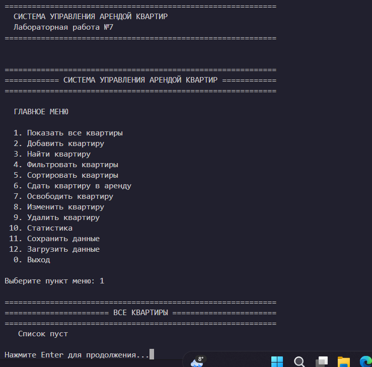
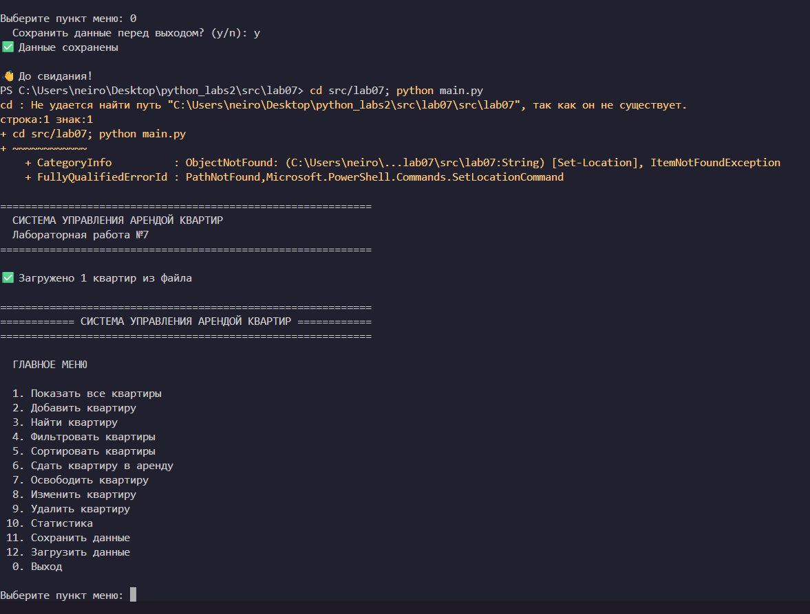
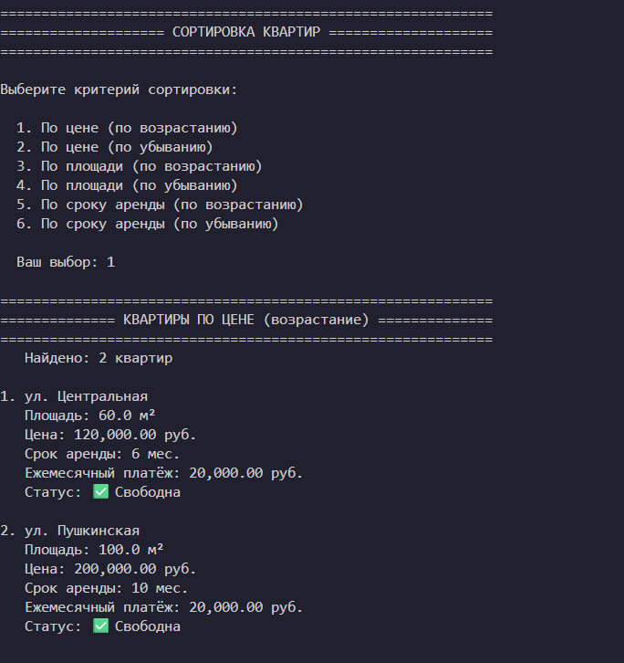
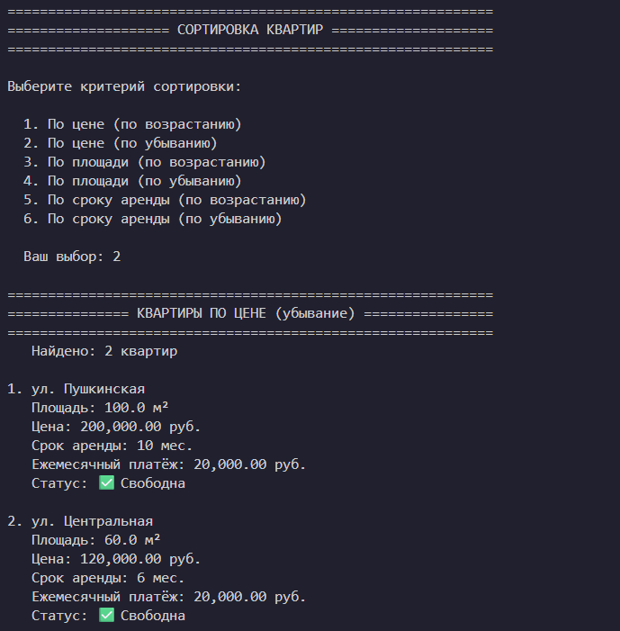
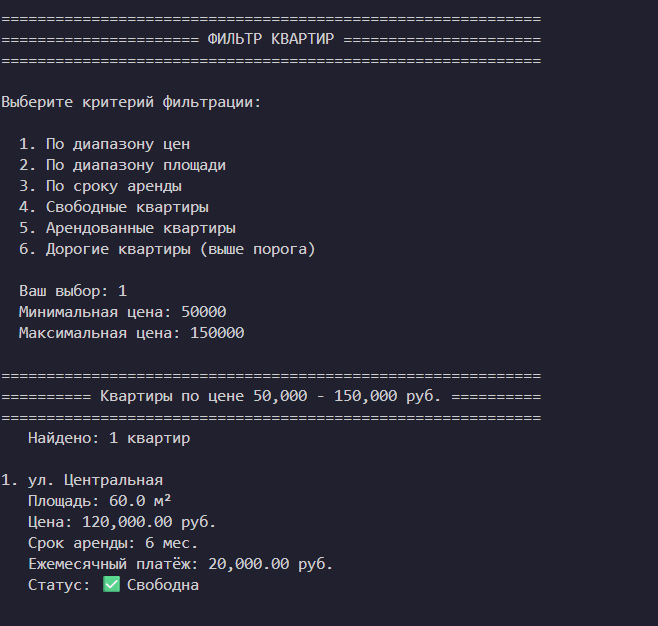
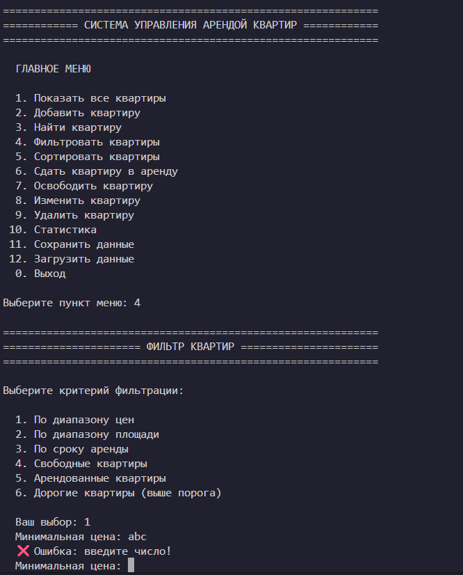
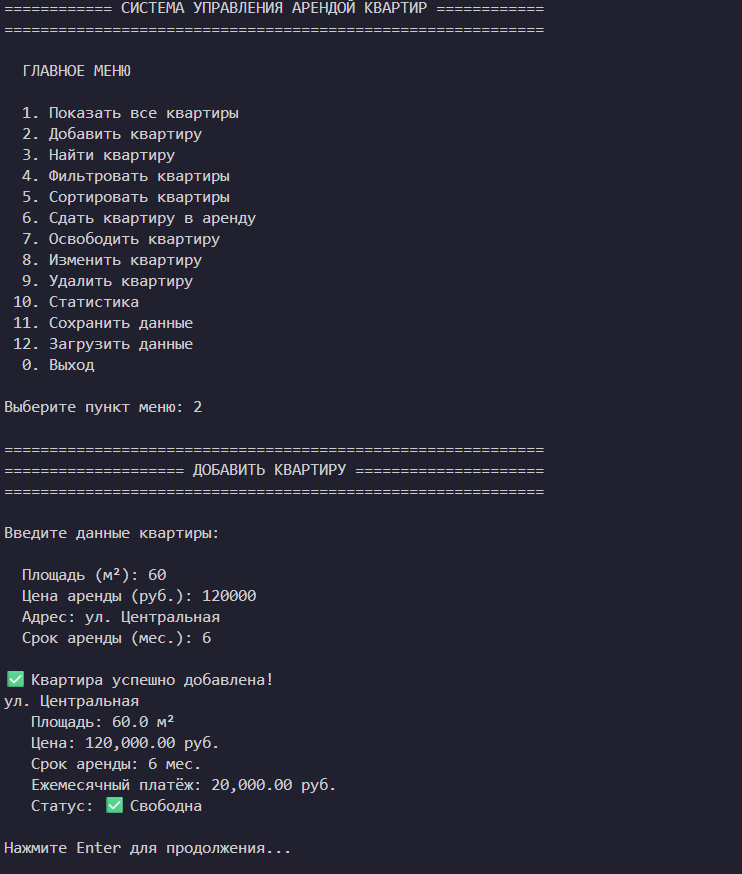

# Лабораторная работа №7 - Консольное приложение
## Вариант 9

### 1. Цель работы
Объединить все знания, полученные в ЛР1–ЛР6, в единое работающее приложение. Реализовать интерактивный CLI-интерфейс с меню и вводом пользователя.

### 2. Структура проекта

```
src/lab07/
├── __init__.py        # Модуль лабораторной работы
├── main.py            # Точка входа, запуск CLI
├── cli.py             # Интерфейс: меню, ввод, вывод
├── app.py             # Бизнес-логика, управление данными
├── exceptions.py      # Собственные исключения
├── storage.py         # Сохранение/загрузка данных (JSON)
└── README.md          # Документация
```

### 3. Архитектура приложения

Приложение построено по принципу разделения на три слоя:

#### Слой 1: CLI (`cli.py`)
- Только ввод/вывод данных
- Никакой бизнес-логики
- Обработка ошибок ввода
- Форматированный вывод

#### Слой 2: Бизнес-логика (`app.py`)
- Класс `ApartmentApp` - управление коллекцией
- Все операции над квартирами
- Валидация данных
- Фильтрация и сортировка

#### Слой 3: Хранение данных (`storage.py`)
- Сохранение в JSON
- Загрузка из JSON
- Преобразование объектов в словари

### 4. Собственные исключения (`exceptions.py`)

| Исключение | Описание |
|------------|----------|
| `ApartmentError` | Базовое исключение |
| `ApartmentNotFoundError` | Квартира не найдена |
| `DuplicateApartmentError` | Дубликат квартиры |
| `InvalidApartmentError` | Некорректные данные |
| `ApartmentOperationError` | Операция запрещена |
| `StorageError` | Ошибка сохранения/загрузки |
| `ConfirmationError` | Операция отменена |

### 5. Меню приложения

```
  ГЛАВНОЕ МЕНЮ

  1. Показать все квартиры
  2. Добавить квартиру
  3. Найти квартиру
  4. Фильтровать квартиры
  5. Сортировать квартиры
  6. Сдать квартиру в аренду
  7. Освободить квартиру
  8. Изменить квартиру
  9. Удалить квартиру
 10. Статистика
 11. Сохранить данные
 12. Загрузить данные
  0. Выход
```

### 6. Функциональность

#### Базовые операции
- **Просмотр всех квартир** - форматированный вывод списка
- **Добавление квартиры** - ввод данных с валидацией
- **Поиск квартиры** - по адресу (частичное совпадение)
- **Удаление квартиры** - с подтверждением операции

#### Фильтрация
- По диапазону цен
- По диапазону площади
- По сроку аренды
- Свободные/арендованные
- Дорогие (выше порога)

#### Сортировка
- По цене (возрастание/убывание)
- По площади (возрастание/убывание)
- По сроку аренды (возрастание/убывание)

#### Управление арендой
- Сдать квартиру в аренду
- Освободить квартиру
- Изменить данные квартиры

#### Статистика
- Общее количество квартир
- Свободные/арендованные
- Средняя цена и площадь
- Минимальная/максимальная цена

#### Сохранение/загрузка
- Автоматическая загрузка при запуске
- Сохранение при выходе
- JSON формат хранения

### 7. Запуск приложения

```bash
cd src/lab07
python main.py
```

### 8. Демонстрация работы

#### Сценарий 1: Запуск и добавление квартир
1. Запуск приложения
2. Автоматическая загрузка данных (если есть)
3. Добавление нескольких квартир через меню
4. Просмотр всех квартир

#### Сценарий 2: Поиск и фильтрация
1. Поиск квартиры по адресу
2. Фильтрация по диапазону цен
3. Фильтрация свободных квартир
4. Сортировка по цене

#### Сценарий 3: Управление арендой
1. Сдача квартиры в аренду
2. Попытка изменить арендованную квартиру (ошибка)
3. Освобождение квартиры
4. Изменение данных квартиры

#### Сценарий 4: Сохранение и загрузка
1. Добавление квартир
2. Сохранение данных
3. Выход из приложения
4. Повторный запуск
5. Автоматическая загрузка данных

### 9. Обработка ошибок

#### Ошибки ввода
- Некорректный пункт меню → "Ошибка: введите число!"
- Пустое обязательное поле → "Поле обязательно для заполнения!"
- Некорректное число → "Ошибка: введите число!"

#### Ошибки предметной области
- Дубликат квартиры → "[DUPLICATE] Квартира с таким адресом уже существует"
- Квартира не найдена → "[NOT_FOUND] Квартира по адресу '...' не найдена"
- Изменение арендованной → "[OPERATION_DENIED] Нельзя изменить арендованную квартиру"

#### Подтверждение операций
- Удаление квартиры → "Вы уверены? (y/n)"
- Выход с несохранёнными → "Сохранить данные перед выходом? (y/n)"

### 10. Примеры использования

#### Добавление квартиры
```
  Введите данные квартиры:

  Площадь (м²): 50
  Цена аренды (руб.): 100000
  Адрес: ул. Примерная, д.1, кв.10
  Срок аренды (мес.): 12

✅ Квартира успешно добавлена!
ул. Примерная, д.1, кв.10
   Площадь: 50.0 м²
   Цена: 100,000.00 руб.
   Срок аренды: 12 мес.
   Ежемесячный платёж: 8,333.33 руб.
   Статус: ✅ Свободна
```

#### Фильтрация
```
  Выберите критерий фильтрации:

  1. По диапазону цен
  2. По диапазону площади
  ...

  Ваш выбор: 1
  Минимальная цена: 50000
  Максимальная цена: 150000

   Найдено: 3 квартир

1. ул. Примерная, д.1, кв.10
   Площадь: 50.0 м²
   Цена: 100,000.00 руб.
   ...
```

#### Статистика
```
  Всего квартир: 5
  Свободных: 3
  Арендованных: 2
  Средняя цена: 120,000.00 руб.
  Средняя площадь: 65.0 м²
  Минимальная цена: 70,000.00 руб.
  Максимальная цена: 200,000.00 руб.
```

### 11. Вывод

В ходе лабораторной работы были изучены:
- **Разбиение на модули и слои** - разделение CLI, бизнес-логики и хранения
- **CLI-интерфейс** - интерактивное меню с вводом/выводом
- **Обработка исключений** - собственные исключения для предметной области
- **Сохранение/загрузка** - работа с JSON файлами
- **Типизация** - аннотации типов во всех модулях
- **Валидация данных** - проверка корректности ввода

### 12. Требования к оценке 5

- [x] Консольное меню с минимум 5 пунктами (реализовано 12 пунктов)
- [x] Обработка некорректного ввода (try/except, валидация)
- [x] Разделение на минимум 2 файла (реализовано 5 файлов)
- [x] Собственные исключения (7 типов исключений)
- [x] Операции поиска и фильтрации (поиск, 6 типов фильтрации)
- [x] Разделение на 3 слоя (CLI, app, storage)
- [x] Форматированный вывод (таблицы, заголовки, эмодзи)
- [x] Сохранение и загрузка данных (JSON)
- [x] Сортировка с выбором стратегии (6 вариантов)
- [x] Типизация всех методов (аннотации типов)
- [x] Docstring для всех публичных функций
- [x] Подтверждение опасных операций (удаление, выход)

### Скриншоты работы программы














